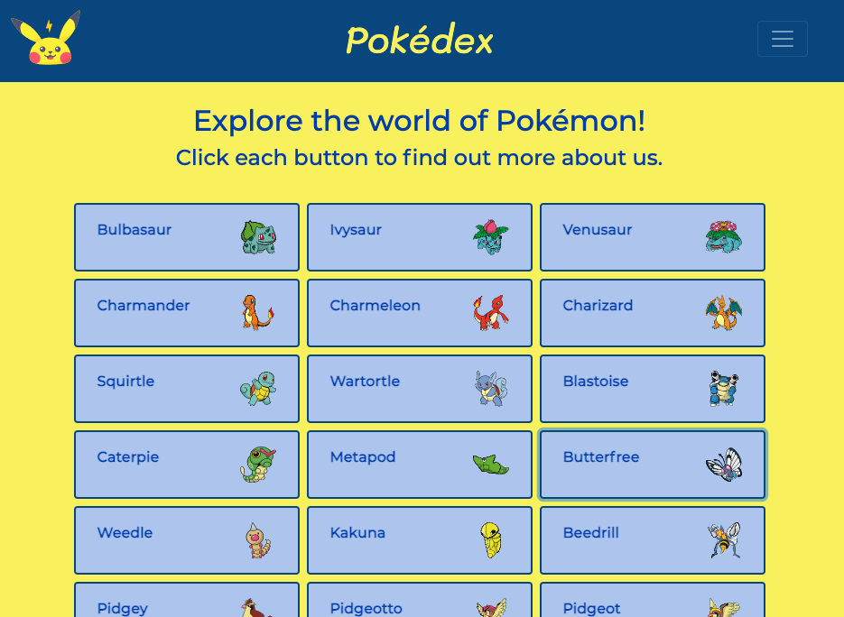

# Pokédex App

This Application was built using vanilla JavaScript and some Jquery. I also used Bootstrap for the UI. 

It uses an external API to display details about Pokemon.

## View of Main Page

Users can click on each button to open a modal displaying more details about each Pokemon.

Here is a link to this [Pokédex App](https://adstrat.github.io/pokedex-js-app/)
